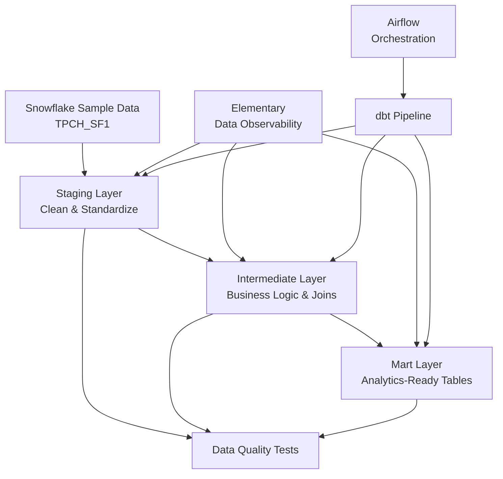
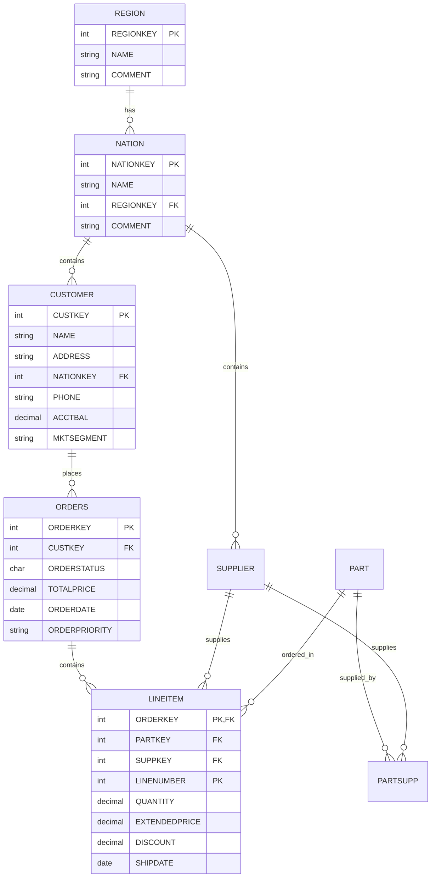

# GotPhoto Case Study - Data Engineering Project

## Introduction

This project demonstrates a comprehensive data engineering pipeline using modern ELT (Extract, Load, Transform) practices. Built on the TPC-H benchmark dataset from Snowflake, it showcases end-to-end data modeling, quality testing, and orchestration using dbt, Airflow, and containerized deployments.

The pipeline transforms raw transactional data into analytics-ready data marts through multiple layers of data modeling, implementing best practices for data quality, observability, and CI/CD automation.

## Data Pipeline Flow



### Pipeline Layers:
1. **Raw Data**: Snowflake TPC-H sample data (8 tables)
2. **Staging**: Clean, standardized dimension and fact tables
3. **Intermediate**: Business logic, joins, and aggregations
4. **Mart**: Final analytics-ready data marts for reporting

## DBT ERD Diagram



## Approach

### Data Modeling Strategy
- **Staging Layer**: Source-conformed models with cleaned column names and data types
- **Intermediate Layer**: Business logic implementation and entity relationships
- **Mart Layer**: Denormalized tables optimized for analytics and reporting

### Data Quality Framework
- **Source Freshness**: Automated monitoring of data freshness with configurable thresholds
- **Schema Tests**: Uniqueness, not-null, relationships, and accepted values validation
- **Custom Tests**: Business rule validation and data quality checks
- **Elementary Integration**: Comprehensive data observability and anomaly detection

### Incremental Loading
- **Orders**: Incremental updates based on `ORDER_KEY` (always increasing)
- **LineItems**: Incremental updates with composite key partitioning by order and year

## Tech Stack

- **Cloud Data Warehouse**: Snowflake
- **Transformation Tool**: dbt (Data Build Tool)
- **Orchestration**: Apache Airflow
- **Data Observability**: Elementary
- **Containerization**: Docker & Docker Compose

## Quick Start

### Prerequisites
- Docker and Docker Compose installed
- Access to a Snowflake instance
- Git installed

### 1. Environment Setup

```bash
# Clone the repository
git clone https://github.com/sarinravishanker/gotphoto_case_study.git
cd gotphoto_case_study

# Copy environment template
cp .env.example .env

# Fill in your Snowflake credentials in .env
SNOWFLAKE_USERNAME=your_username
SNOWFLAKE_PASSWORD=your_password
```

### 2. Update Snowflake Configuration

Edit `dbt_project/profiles/profiles.yml` with your Snowflake details:
```yaml
gotphoto_snowflake:
  outputs:
    sandbox:
      account: YOUR_ACCOUNT.REGION.PROVIDER  # e.g., jq81284.europe-west3.gcp
      database: YOUR_DATABASE               # e.g., ANALYTICS_DB
      warehouse: YOUR_WAREHOUSE            # e.g., COMPUTE_WH
      schema: YOUR_SCHEMA                  # e.g., DEFAULT
      # username and password from .env
```

### 3. Build and Start Services

```bash
# Build and start all services
docker-compose up --build

# Access Airflow UI at http://localhost:8080
# Login: airflow / airflow
```

### 4. Run dbt Pipeline

```bash
# Install dbt packages
docker-compose exec airflow-webserver bash
cd dbt_project
dbt deps --profiles-dir profiles

# Test connection
dbt debug --profiles-dir profiles

# Run the pipeline
dbt run --exclude elementary --profiles-dir profiles

# Run tests
dbt test --profiles-dir profiles

# Check source freshness
dbt source freshness --profiles-dir profiles
```

## Testing via the Airflow UI

### Available DAGs
1. **`dbt_pipeline`**: Main data pipeline DAG
   - Runs every 4 hours
   - Executes dbt models in sequence (staging → intermediate → mart)
   - Includes data quality tests and source freshness checks

### Manual Testing Steps
1. Navigate to http://localhost:8080
2. Login with `airflow` / `airflow`
3. Find the `dbt_pipeline` DAG
4. Toggle the DAG to "ON" if paused
5. Click the "Play" button to trigger manually
6. Monitor task progress in the Graph View
7. Check logs for detailed execution information

## dbt Tests

### Test Categories

#### 1. Source Tests
```bash
# Source freshness monitoring
dbt source freshness --profiles-dir profiles
```

#### 2. Model Tests
```bash
# Run all tests
dbt test --profiles-dir profiles

# Run tests for specific layer
dbt test --select staging --profiles-dir profiles
dbt test --select intermediate --profiles-dir profiles
dbt test --select mart --profiles-dir profiles
```

#### 3. Test Types Implemented
- **Uniqueness**: Primary key constraints
- **Not Null**: Critical field validation
- **Relationships**: Foreign key integrity
- **Accepted Values**: Enumerated value validation
- **Custom Business Rules**: Domain-specific validation

#### 4. Data Observability (Elementary)
```bash
# Generate data quality report
edr report

# Monitor data freshness and anomalies
edr monitor
```

## Orchestration via Airflow on Production

### Production Deployment Steps

#### 1. Infrastructure Setup
```bash
# Production docker-compose with proper resource allocation
docker-compose -f docker-compose.prod.yml up -d

# Configure external PostgreSQL for Airflow metadata
# Set up proper secret management (AWS Secrets Manager, HashiCorp Vault)
```

#### 2. Environment Configuration
```bash
# Production environment variables
AIRFLOW__CORE__EXECUTOR=CeleryExecutor
AIRFLOW__CELERY__BROKER_URL=redis://redis:6379/0
SNOWFLAKE_USERNAME=${SECRET_SNOWFLAKE_USERNAME}
SNOWFLAKE_PASSWORD=${SECRET_SNOWFLAKE_PASSWORD}
```

#### 3. Monitoring Setup
```bash
# Set up Airflow monitoring
# Configure alerts for DAG failures
# Implement data quality alerts via Elementary
# Set up log aggregation and monitoring
```

#### 4. CI/CD Pipeline
- Automated deployment via GitHub Actions
- SQL linting and dbt testing on PRs
- Automated testing in staging environment
- Blue-green deployments for zero downtime

#### 5. Production Scheduling
```python
# Production DAG schedule
default_args = {
    "schedule_interval": "0 */4 * * *",  # Every 4 hours
    "max_active_runs": 1,
    "catchup": False,
    "retries": 2,
    "retry_delay": timedelta(minutes=15),
}
```

## Future Improvements

### Data Engineering Enhancements
- [ ] **Schema Evolution**: Implement automated schema change detection and handling
- [ ] **Data Lineage**: Enhanced lineage tracking with DataHub or Apache Atlas
- [ ] **Streaming Data**: Add real-time data processing with Kafka/Kinesis
- [ ] **Data Catalog**: Implement comprehensive data discovery and cataloging

### Pipeline Optimizations
- [ ] **Dynamic DAGs**: Generate DAGs based on configuration files
- [ ] **Parallel Processing**: Optimize dbt model dependencies for parallel execution
- [ ] **Incremental Strategies**: Implement more sophisticated incremental loading patterns
- [ ] **Data Partitioning**: Optimize Snowflake table clustering and partitioning

### Quality & Monitoring
- [ ] **Great Expectations**: Advanced data quality validation
- [ ] **Data Drift Detection**: ML-based anomaly detection for data patterns
- [ ] **SLA Monitoring**: Implement comprehensive SLA tracking and alerting
- [ ] **Cost Optimization**: Automated Snowflake warehouse scaling based on workload

### DevOps & Infrastructure
- [ ] **Kubernetes**: Migrate to Kubernetes for better scalability
- [ ] **Terraform**: Infrastructure as Code for cloud resources
- [ ] **Multi-Environment**: Separate dev/staging/prod environments
- [ ] **Secrets Management**: Enhanced security with dedicated secret management

### Analytics & Business Intelligence
- [ ] **Reverse ETL**: Sync data back to operational systems
- [ ] **Real-time Dashboards**: Streaming analytics dashboards
- [ ] **ML Feature Store**: Feature engineering pipeline for ML models
- [ ] **Data Products**: Self-service analytics platform

---