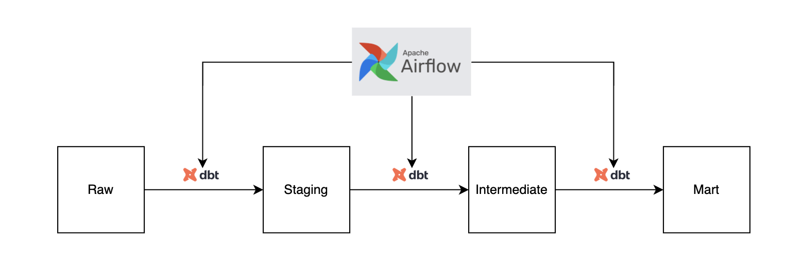
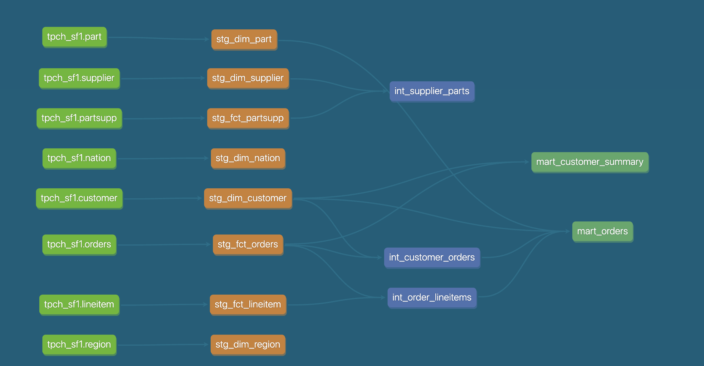

# GotPhoto Case Study - Data Platform

## Table of Contents

- [Project Overview](#project-overview)
- [Data Pipeline Flow](#data-pipeline-flow)
- [DBT Lineage](#dbt-lineage)
- [Approach](#approach)
- [Tech Stack](#tech-stack)
- [Quick Start](#quick-start)
- [Testing via the Airflow UI](#testing-via-the-airflow-ui)
- [Orchestration Strategies](#orchestration-strategies)

## Project Overview

This project demonstrates a data engineering pipeline that processes TPC-H benchmark data
using modern ELT practices using dbt, Airflow, and Snowflake.The pipeline is containerized using Docker for easy deployment and scalability.

> **Note**: The DBT `profiles.yml` file is configured to use the `sandbox` target by default.

## Data Pipeline Flow



### Pipeline Layers:
1. **Raw Data**: Snowflake TPC-H sample data (8 tables)
2. **Staging**: Clean, standardized dimension and fact tables
3. **Intermediate**: Business logic, joins, and aggregations
4. **Mart**: Final analytics-ready data marts for reporting

## DBT Lineage




## Approach

### Data Modeling Strategy
- **Staging Layer**: Source-conformed dimension models with aliased column names
- **Intermediate Layer**: Business logic implementation and entity relationships
- **Mart Layer**: Denormalized tables optimized for analytics and reporting

### Model Design Reasoning

#### Staging Layer: Dimensional Modeling Foundation
The staging layer follows dimensional modeling principles with clear separation between dimensions and facts:

**Dimension Tables (`stg_dim_*`)**:
- **`stg_dim_region`** & **`stg_dim_nation`**: Geographic hierarchy for regional analysis
- **`stg_dim_customer`**: Customer data with demographic information
- **`stg_dim_supplier`**: Supplier data for vendor analysis
- **`stg_dim_part`**: Parts(products) catalog with manufacturing details

**Fact Tables (`stg_fct_*`)**:
- **`stg_fct_orders`**: Order header information (one record per order)
- **`stg_fct_lineitem`**: Order line details (multiple lines per order)
- **`stg_fct_partsupp`**: Supplier-part relationships with pricing


This separation enables efficient joins, supports star schema design, and provides clear semantic meaning. 
The `dim_` and `fct_` prefixes immediately communicate the table's purpose to analysts and downstream consumers.

#### Intermediate Layer: Business Logic Implementation
**`int_customer_orders`**: Pre-aggregated customer order metrics
- *Purpose*: Reduces computation for customer-centric analysis
- *Business Logic*: Customer lifetime value, order frequency, average order size

**`int_order_lineitems`**: Enriched order details with line-level calculations
- *Purpose*: Order profitability analysis and product performance
- *Business Logic*: Extended pricing, discounts, taxes, shipping calculations

**`int_supplier_parts`**: Supplier performance and part availability
- *Purpose*: Supply chain optimization and vendor analysis
- *Business Logic*: Supplier reliability, part costs, availability metrics

#### Mart Layer: Analytics-Ready Data Products
**`mart_orders`**: Comprehensive order analytics
- *Design*: Wide table with all order dimensions and metrics
- *Optimization*: Pre-joined for fast dashboard queries
- *Use Case*: Order management dashboards, sales reporting

**`mart_customer_summary`**: Customer analytics and segmentation
- *Design*: Aggregated customer metrics with derived KPIs
- *Optimization*: Pre-calculated customer lifetime value, RFM scores
- *Use Case*: Customer relationship management, marketing analytics

### Potential Business Questions Answered

- **Customer Metrics**: Customer lifetime value (CLV), churn rate, and segmentation by purchasing behavior.
- **Revenue Metrics**: Total revenue, gross margin, and average order value.
- **Supplier Metrics**: Supplier reliability score and average lead time.
- **Parts Metrics**: Inventory turnover rate and parts with single-source risk.


### Incremental Loading
- **Orders**: Incremental updates based on `ORDER_KEY` (*Assumed always increasing*)
- **LineItems**: Incremental updates with composite key, clusering by order and year

## dbt Tests Implemented

- **Uniqueness**: Primary key constraints
- **Not Null**: Critical field validation
- **Relationships**: Foreign key integrity
- **Accepted Values**: Enumerated value validation

## Tech Stack

- **Cloud Data Warehouse**: Snowflake
- **Transformation Tool**: dbt (Data Build Tool)
- **Orchestration**: Apache Airflow
- **Data Observability**: Elementary
- **Containerization**: Docker & Docker Compose

## Quick Start

### Prerequisites
- Docker and Docker Compose installed
- Access to a Snowflake instance
- Git installed

### 0. Snowflake Database Setup (Required)

Before running the pipeline, create the necessary databases and schemas in your Snowflake instance manually:

```sql
-- Connect to your Snowflake instance and run these commands

-- Create databases
CREATE DATABASE IF NOT EXISTS ANALYTICS_DB;
CREATE DATABASE IF NOT EXISTS ELEMENTARY;

-- Create schemas in ANALYTICS_DB
USE DATABASE ANALYTICS_DB;
CREATE SCHEMA IF NOT EXISTS STAGING;
CREATE SCHEMA IF NOT EXISTS INTERMEDIATE;
CREATE SCHEMA IF NOT EXISTS MART;

-- Verify schemas were created
SHOW SCHEMAS IN DATABASE ANALYTICS_DB;

-- Grant necessary permissions (adjust role as needed)
GRANT USAGE ON DATABASE ANALYTICS_DB TO ROLE YOUR_ROLE;
GRANT USAGE ON DATABASE ELEMENTARY TO ROLE YOUR_ROLE;
GRANT ALL ON SCHEMA ANALYTICS_DB.STAGING TO ROLE YOUR_ROLE;
GRANT ALL ON SCHEMA ANALYTICS_DB.INTERMEDIATE TO ROLE YOUR_ROLE;
GRANT ALL ON SCHEMA ANALYTICS_DB.MART TO ROLE YOUR_ROLE;
```

### 1. Environment Setup

```bash
# Clone the repository
git clone https://github.com/sarinravishanker/gotphoto_case_study.git
cd gotphoto_case_study

# Copy environment template
cp .env .env

# Fill in your Snowflake credentials in .env
SNOWFLAKE_USERNAME=your_username
SNOWFLAKE_PASSWORD=your_password
```

### 2. Build and Start Services

```bash
# Build and start all services
docker-compose up --build

# Access Airflow UI at http://localhost:8080
# Login: airflow / airflow
```

### 3. Run dbt Pipeline

```bash
# Install dbt packages
docker-compose exec airflow-webserver bash
cd dbt_project
dbt deps --profiles-dir profiles

# Test connection
dbt debug --profiles-dir profiles

# Initialize elementary models (first-time setup)
dbt run --select elementary --profiles-dir profiles

# Run the models & tests defined
dbt build --exclude elementary --profiles-dir profiles

# Check source freshness
dbt source freshness --profiles-dir profiles
```

## Testing via the Airflow UI

### Available DAGs
1. **`dbt_pipeline`**: Main data pipeline DAG
   - Runs every 4 hours
   - Executes dbt models and dbt tests in sequence (staging → intermediate → mart)

### Manual Testing Steps
1. Navigate to http://localhost:8080
2. Login with username:`airflow` and password:`airflow`
3. Find the `dbt_pipeline` DAG
4. Toggle the DAG to "ON" if paused
5. Click the "Play" button to trigger manually
6. Monitor task progress in the Graph View
7. Check logs for detailed execution information

## Orchestration Strategies

- **AWS MWAA (Managed Airflow)**: Fully managed Airflow service
  - Auto-scaling, patching, and monitoring included
  - Native integration with S3, RDS, and Secrets Manager

- **GCP Cloud Composer (Managed Airflow)**: Google's managed Airflow offering
  - Integrated with BigQuery, Cloud Storage, and IAM
  - Auto-scaling with Kubernetes backend

- **Airflow on Kubernetes**: Self-managed Airflow using Kubernetes Executor
  - Horizontal auto-scaling with dynamic pod allocation
  - Resource isolation and multi-tenancy support
  - Custom operator deployment for dbt integration


